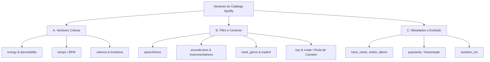

# Questões Norteadoras (Guiding Questions)

As **Guiding Questions** constituíram o alicerce metodológico e a bússola analítica que nortearam todo o ciclo de vida deste projeto.

Elas definiram a transição de uma exploração empírica inicial sobre determinantes de popularidade para a concepção de um sistema robusto de inteligência sonora, segmentação acústica por aprendizado não supervisionado e engenharia de transições musicais.

---

## 1. Guiding Questions 1.0 — Exploração de Popularidade e Áudio

Na fase inicial do desafio, a investigação focou em compreender a relação direta entre os atributos intrínsecos de áudio fornecidos pela API do Spotify e o desempenho comercial (popularidade) das faixas:

- **Influência dos atributos gerais**: Como parâmetros como instrumentalidade, acusticidade, energia e dançabilidade influenciam a popularidade de uma música?
- **Dançabilidade**: Músicas com pontuação maior de dançabilidade possuem mais popularidade?
- **Pressão sonora (Loudness War)**: O volume médio (*loudness*) influencia a popularidade de uma música?
- **Gêneros musicais**: Quais gêneros pontuam melhor em popularidade?
- **Conteúdo explícito**: Músicas explícitas podem ser menos populares? (Devido a filtros parentais, menor inclusão em playlists editoriais de amplo alcance, etc.)
- **Andamento (BPM)**: Músicas com BPM maior são mais populares?
- **Relação Tempo vs. Energia**: Músicas com BPM maior são necessariamente mais energéticas?
- **Gêneros mais energéticos**: Quais são os gêneros musicais com maior média de energia?
- **Duração da faixa**: Músicas longas pontuam pior em popularidade em comparação a faixas com duração padrão para rádio e streaming (entre 2:30 e 4:30 minutos)?

!!! note "Achado Fundamental"
    Os experimentos econométricos e de regressão conduzidos no notebook de exploração demonstraram que os atributos de áudio isolados possuem correlação linear praticamente nula com a popularidade comercial ($R^2 \approx 0$). Isso revelou que o sucesso comercial depende de variáveis externas de tração cultural, investimento em marketing e curadoria em playlists. Essa conclusão redirecionou o projeto para o valor prático real dos dados: a **curadoria de atmosferas sonoras sob medida**.

---

## 2. Guiding Questions 2.0 — Curadoria de Pista e Engenharia de Ambientes

Com a mudança de paradigma analítico, formulou-se a segunda geração de questões norteadoras, focada em resolver o problema de **segmentação de momentos, consistência de atmosfera e fluidez sequencial**:

### GQ1: Caracterização e Segmentação de "Momentos"
> **Como caracterizar e segmentar os "momentos" de uma festa ou espaço comercial usando atributos musicais?**
>
> - **Objetivo**: Definir matematicamente o que constitui o *Warm-up* (aquecimento/acolhimento), o *Peak Time* (auge da pista/experiência) e o *Cool-down* (desaceleração/encerramento), delimitando intervalos de valores para `energy`, `danceability`, `tempo` e `acousticness`.

### GQ2: O Papel da Valência na Montanha-Russa Emocional
> **Qual é o papel da "Valência" (`valence`) na construção da montanha-russa emocional da experiência sonora?**
>
> - **Objetivo**: Descobrir se faixas de alta energia sempre possuem alta valência (felicidade/euforia) ou se existem faixas de alta energia e baixa valência (músicas intensas, densas ou "escuras") que podem ser estrategicamente utilizadas para construir tensão e liberação na pista.

### GQ3: Filtragem e Garantia de Qualidade Acústica
> **Como filtrar e garantir a "qualidade de pista" e som ambiente das faixas antes de sequenciá-las?**
>
> - **Objetivo**: Identificar quais limites de `speechiness` (evitar faixas faladas, piadas e podcasts), `instrumentalness` (evitar faixas puramente instrumentais sem pulso rítmico em horários inoportunos) e `liveness` (evitar gravações ao vivo com baixa qualidade acústica) devem ser aplicados na limpeza da base de dados.

### GQ4: Regras Matemáticas para Transição Fluida
> **Como definir regras de transição matemática para uma sequência sonora contínua e sem quebras?**
>
> - **Objetivo**: Minimizar variações abruptas de ritmo (`tempo`/BPM) e pressão sonora (`loudness`) entre faixas contíguas, proporcionando transições harmônicas e imperceptíveis para o ouvinte.

---

## 3. Taxonomia e Papel das Variáveis do Catálogo

Para operacionalizar a solução, as variáveis do dataset foram categorizadas em três níveis funcionais:



### A. Variáveis Críticas (As Engrenagens da Experiência)
- **`energy` e `danceability`**: Determinam a intensidade física da música e o quanto ela estimula o movimento. São as variáveis nucleares para desenhar a curva energética do ambiente ou evento.
- **`tempo` (BPM)**: Crucial para o ritmo corporal e para a técnica de transição rítmica (*beatmatching*). Saltos abruptos de andamento (ex: saltar de 80 BPM para 140 BPM sem preparação) quebram o engajamento e dispersam o público.
- **`valence`**: Define a vibração emocional da faixa (positiva/solar vs. intensa/nostálgica/melancólica).
- **`loudness`**: O volume médio percebido em dB. Garante que as trocas de faixa não gerem quedas ou picos bruscos de pressão acústica.

### B. Variáveis de Filtro e Contexto (Curadoria e Qualidade)
- **`speechiness`**: Essencial para expurgar faixas faladas (áudios de comédia, introduções de álbuns, poemas e podcasts). Em som ambiente e dança, adota-se o corte estrito de ruído falado.
- **`acousticness` e `instrumentalness`**: Permitem distinguir sonoridades acústicas e intimistas (ideais para recepção, cafeterias e jantares) de produções sintetizadas e eletrônicas (comuns no pico da pista).
- **`track_genre`**: Viabiliza a montagem de blocos temáticos e preserva a coerência estilística da programação.
- **`explicit`**: Parâmetro essencial de conformidade para adequação ao perfil do público e restrições éticas de cada estabelecimento comercial.
- **`key` e `mode` (Tom e Escala)**: A base da **mixagem harmônica profissional**. Permite encadear músicas cujas tonalidades sejam musicalmente compatíveis segundo a **Roda de Camelot**, eliminando choques de notas e dissonâncias entre faixas consecutivas.

### C. Variáveis Secundárias e Identificadores (Exibição e Controle)
- **`track_id`, `track_name`, `artists`, `album_name`**: Metadados indispensáveis para identificação, entrega visual e integração com APIs de áudio, sem peso no cálculo matemático da transição.
- **`popularity`**: Utilizada como métrica secundária de desempate. Entre duas faixas de perfil acústico equivalente, prioriza-se a mais conhecida para gerar reconhecimento e identificação imediata com os frequentadores.
- **`duration_ms`**: Utilizada no cômputo da duração total da grade de programação musical.

---

## 4. Proposta de Estrutura de Fluxo (A Curva da Experiência)

Com base nas variáveis críticas, estabeleceu-se a arquitetura de uma curva sonora progressiva dividida em 4 fases fundamentais:

```text
Intensidade
   ▲                                  [Fase 3: Peak Time]
   │                                  MÁXIMA ENERGIA E LOUDNESS
   │                                  ┌───────────────────┐
   │                                 /                     \
   │         [Fase 2: Warm-up Ativo]/                       \  [Fase 4: Cool-down]
   │         Elevação gradual de                             \ Redução física com
   │         energy + danceability                            \ valence elevada
   │       ┌───────────────────────/                           \───────────────
   │      /
   │     /   [Fase 1: Warm-up Inicial]
   │    /    Acústico, andamento moderado
   │───┘     e energia contida
   └─────────────────────────────────────────────────────────────────────────────►
   0%        20%                     50%                  85%            100%
                               Tempo Decorrido
```

1. **Fase 1: Warm-up Inicial (0% a 20% do tempo)**: Músicas de transição, orgânicas (`acousticness` elevado), andamento moderado (`tempo` médio/baixo) e energia comedida para acolhimento inicial.
2. **Fase 2: Warm-up Ativo (20% a 50% do tempo)**: Elevação progressiva de `energy` e `danceability`, introdução de batidas mais marcadas e inclusão de faixas de maior `popularity`.
3. **Fase 3: Peak Time (50% a 85% do tempo)**: O auge sensorial. Faixas com máxima `energy`, alta `danceability` e `loudness` constante, estabilizando o BPM no patamar ótimo da proposta do espaço.
4. **Fase 4: Cool-down (85% a 100% do tempo)**: Desaceleração da intensidade física com preservação de `valence` alta ou nostálgica, consolidando uma memória emocional duradoura e positiva.

---

## 5. Princípios de Transição do DJ

A lógica algorítmica de encadeamento foi inspirada nas melhores práticas dos profissionais de discotecagem:

> *"O DJ olha para o tempo, a tonalidade e a harmonização das faixas. Ele ajusta a velocidade (pitch) para que as batidas se alinhem e a tonalidade para que as músicas estejam em harmonia. O DJ também utiliza o software para marcar cue points, que são marcas pré-configuradas que indicam onde começar a batida da nova faixa. Esses elementos são cruciais para criar transições suaves e fluidas entre as faixas, mantendo a continuidade emocional e energética do público."*
>
> — *Mix set DJ: como criar transições perfeitas que transformam pistas em experiências únicas (DropDaily)*

Esses conceitos sustentam o módulo de transição do **Retail Sound**, que combina **alinhamento de BPM** (diferença mínima de andamento), **compatibilidade tonal pela Roda de Camelot** e **mixagem com equal-power crossfading**.

---

## 6. Equipe do Projeto (Time 6)

O desenvolvimento das questões norteadoras e das soluções técnicas reuniu os seguintes pesquisadores:

| Integrante | Função no Projeto |
| :--- | :--- |
| **Gabriel Maciel Araújo** | Engenharia de Software, Modelagem e Aplicação Streamlit |
| **Matheus Henrique Picone Rosa** | Análise Estatística, Curadoria e Notebooks Analíticos |
| **João Vítor Carvalho Barbosa** | Processamento de Dados, ETL e Engenharia de Features |
| **Mahiaara Amanda Pereira Barros** | Pesquisa Comportamental, Revisão e Métricas de Áudio |
| **Keila Alves Ferreira** | Curadoria de Negócio, Documentação e Validação de Casos de Uso |
