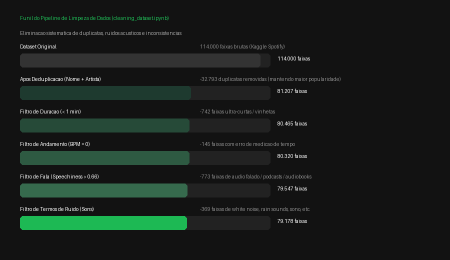

# Limpeza e Tratamento do Dataset Spotify

A etapa de higienização dos dados foi desenvolvida para transformar o catálogo bruto em uma base consistente, confiável e direcionada para aplicações práticas de curadoria musical comercial.

O processo completo está implementado no notebook [`notebooks/cleaning_dataset.ipynb`](../../notebooks/cleaning_dataset.ipynb) e opera em dois grandes eixos: **desduplicação inteligente** e **eliminação de ruídos técnicos e não-musicais**.

---

## 1. O Funil de Higienização

O dataset original continha **114.000 faixas**. A aplicação dos critérios de consistência resultou em uma redução controlada para **79.178 faixas limpas**, eliminando redundâncias e gravações impróprias para execução musical em ambientes de varejo e serviços.

### Resumo Quantitativo do Funil

| Etapa | Critério / Filtro | Registros Removidos | Registros Restantes |
|---|---|---|---|
| **Base Bruta** | Carga inicial do dataset | — | 114.000 |
| **Desduplicação** | Combinação única `track_name` + `artists` (mantendo maior popularidade) | 32.793 | 81.207 |
| **Filtro Técnico** | Faixas com duração inferior a 60 segundos (`duration_ms < 60000`) | 742 | 80.465 |
| **Filtro Técnico** | Faixas sem andamento rítmico detectado (`tempo == 0`) | 145 | 80.320 |
| **Filtro de Conteúdo** | Gravações predominantemente faladas (`speechiness > 0.66`) | 773 | 79.547 |
| **Filtro de Ruído** | Efeitos sonoros e sons ambientais (*rain sounds*, *white noise*, etc.) | 369 | **79.178** |

---

## 2. Critérios de Limpeza em Detalhe

### A. Desduplicação por Relevância
No catálogo original, faixas idênticas costumam figurar repetidas vezes devido a coletâneas, relançamentos regionais e compilações temáticas. 

Para resolver o problema sem perder relevância:
1. Os campos `track_name` e `artists` foram normalizados (conversão para minúsculas e remoção de espaços sobressalentes).
2. Criou-se uma chave composta única `track_name | artists`.
3. Quando múltiplas versões da mesma faixa existiam, foi preservada a versão com **maior pontuação de popularidade**, garantindo metadados consolidados e representativos.

### B. Filtros de Integridade Técnica de Áudio
- **Duração mínima (`duration_ms < 60000`)**: Faixas com menos de 1 minuto correspondem a vinhetas, introduções curtas ou faixas corrompidas, inadequadas para compor grades de programação musical.
- **Andamento nulo (`tempo == 0`)**: Registros sem detecção de BPM indicam falhas na extração dos atributos sonoros pela API do Spotify.

### C. Filtro de Conteúdo Falado (`speechiness > 0.66`)
O atributo `speechiness` avalia a presença de palavras faladas. Valores superiores a `0.66` caracterizam faixas tipicamente compostas por podcasts, audiolivros, sermões ou esquetes cômicas, que inviabilizariam o uso em som ambiente comercial.

### D. Purificação de Efeitos Sonoros e Sons Ambientes
Mesmo com categorização por gênero musical, existem faixas catalogadas contendo gravações literais de ruído para auxílio no sono ou relaxamento. Uma filtragem por palavras-chave no título da faixa identificou e expurgou registros contendo termos como:
- *rain sounds*, *white noise*, *nature sounds*, *sleep*, *meditation*, *ambient*, *environmental sounds*, *soothing*, *soundscape*.

---

## 3. Comportamento Acústico Pré e Pós-Tratamento

A distribuição dos parâmetros acústicos das faixas após o saneamento evidencia a remoção de distorções e pontos atípicos na base:

A base resultante consolidada em `dataset/dataset_cleaned.csv` fornece a estrutura estável necessária para as fases seguintes de **modelagem por agrupamento (clustering)** e para o motor de recomendação em tempo real.