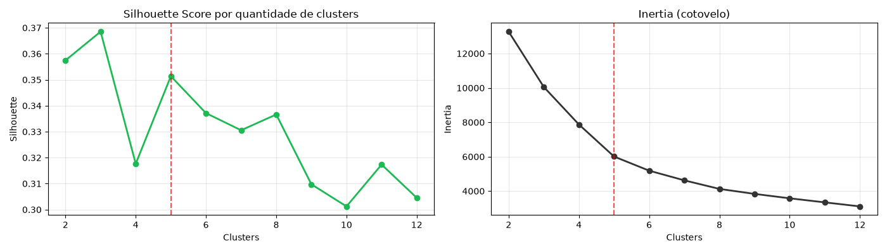
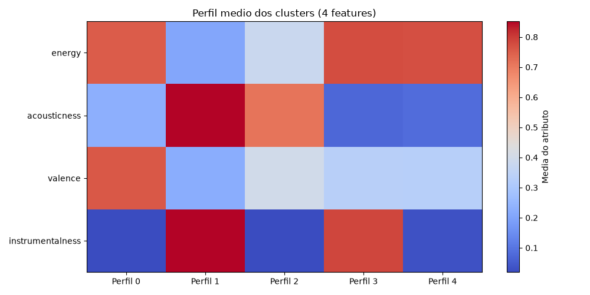
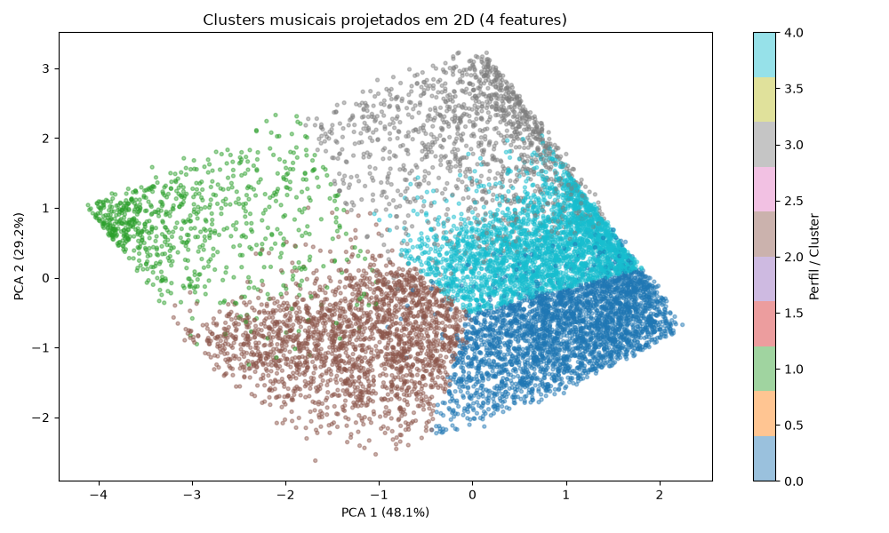

# Agrupamento Acústico (Clustering)

A sonorização profissional de pontos comerciais exige que a seleção musical vá além de rótulos tradicionais de gênero. Rótulos como "rock", "pop" ou "eletrônica" abrigam desde baladas intimistas até faixas altamente agressivas. 

Para estruturar atmosferas sonoras previsíveis e eficazes, aplicamos aprendizado de máquina não supervisionado (**K-Means**) sobre os atributos essenciais de áudio do Spotify, conforme documentado no notebook [`notebooks/cluster_analysis.ipynb`](../../notebooks/cluster_analysis.ipynb).

---

## 1. Seleção de Atributos e Padronização

Após testes empíricos de interpretabilidade e ruído dimensional, quatro dimensões sonoras fundamentais foram selecionadas:

- **Energy (Energia)**: Medida perceptual de intensidade, velocidade e volume aparente da faixa.
- **Acousticness (Acústica)**: Probabilidade de a gravação utilizar instrumentos acústicos/orgânicos versus produção sintetizada/elétrica.
- **Valence (Valência / Positividade)**: Grau de positividade musical transmitido (faixas com alta valência soam alegres e eufóricas; baixa valência soam melancólicas ou sérias).
- **Instrumentalness (Instrumentalidade)**: Probabilidade de a faixa não conter vocais falados ou cantados.

Variáveis correlacionadas ou redundantes (como `loudness` e `danceability`) foram descartadas para maximizar a separação geométrica dos agrupamentos. Os dados foram então normalizados através do **StandardScaler** ($Z$-score), equalizando as variâncias.

---

## 2. Determinação do Número Ótimo de Agrupamentos

A definição do número ideal de clusters ($K$) combinou a métrica de **Inércia (Método do Cotovelo / Elbow Method)** e o **Coeficiente de Silhueta (Silhouette Score)** para $K \in [2, 10]$:

### Diagnóstico
- O coeficiente de silhueta atinge um pico destacado em **$K = 5$** ($\text{Score} \approx 0{,}351$).
- Esse ponto oferece a melhor relação entre coesão interna dos grupos e separação entre atmosferas comerciais distintas, sem gerar hiperfragmentação desnecessária.

---

## 3. Os 5 Perfis Musicais Descobertos

O modelo K-Means final agrupou as faixas do catálogo limpo em cinco atmosferas sonoras bem delimitadas:

### Métricas dos Centróides (Escala Original 0 a 1)

| Cluster | Nome do Perfil | Total de Faixas | Energy | Acousticness | Valence | Instrumentalness | Vocais |
|:---:|:---|:---:|:---:|:---:|:---:|:---:|:---:|
| **C0** | **Social & Ensolarado** | 23.854 | 0,752 | 0,231 | 0,759 | 0,021 | Presentes |
| **C1** | **Ambiental & Relaxante** | 6.311 | 0,207 | 0,852 | 0,224 | 0,851 | Ausentes |
| **C2** | **Acústico & Intimista** | 17.013 | 0,377 | 0,713 | 0,397 | 0,020 | Presentes |
| **C3** | **Eletrônico & Moderno** | 9.627 | 0,774 | 0,073 | 0,335 | 0,785 | Ausentes |
| **C4** | **Intenso & Dinâmico** | 22.373 | 0,773 | 0,082 | 0,330 | 0,030 | Presentes |

---

## 4. Aplicação Comercial de Cada Cluster

Cada agrupamento atende a objetivos comportamentais específicos no ponto de venda:

### Cluster 0 — Social & Ensolarado
- **Características**: Alta energia, alto astral, produção moderna e forte presença vocal.
- **Ambientes Indicados**: Lojas de departamento, praças de alimentação movimentadas, eventos promocionais e ambientes que buscam estimular otimismo e socialização.

### Cluster 1 — Ambiental & Relaxante
- **Características**: Baixíssima energia, instrumentação puramente acústica e ausência total de vocais distrativos.
- **Ambientes Indicados**: Livrarias, bibliotecas, consultórios médicos, spas e áreas de foco intelectual onde a música não deve competir com a atenção cognitiva.

### Cluster 2 — Acústico & Intimista
- **Características**: Ritmo moderado e acolhedor, texturas orgânicas e vocais suaves.
- **Ambientes Indicados**: Cafeterias, confeitarias, bistrôs, restaurantes à la carte e lojas de decoração. Cria conforto e estimula a permanência prolongada do cliente.

### Cluster 3 — Eletrônico & Moderno
- **Características**: Batidas eletrônicas precisas, alta energia e predominância instrumental.
- **Ambientes Indicados**: Lojas de vestuário contemporâneo, flagships de tecnologia, coworkings descontraídos e lounges urbanos.

### Cluster 4 — Intenso & Dinâmico
- **Características**: Alta intensidade sonora, ritmo veloz, arranjos vigorosos (rock, metal, urban pop).
- **Ambientes Indicados**: Academias, boxes de crossfit, lojas de suplementação e artigos esportivos, auxiliando na motivação e na cadência de esforço físico.

---

## 5. Projeção Espacial e Validação Dimensional (PCA)

Para inspecionar visualmente a segregação dos agrupamentos em 4 dimensões, aplicamos a Análise de Componentes Principais (**PCA**), projetando o espaço vetorial em 2 componentes:

A distribuição no plano PCA confirma a formação de fronteiras nítidas:
- O eixo horizontal discrimina com precisão a transição entre produções sintéticas/elétricas e arranjos acústicos;
- O eixo vertical separa faixas puramente instrumentais de faixas guiadas por linhas vocais.

Essa topologia vetorial é utilizada diretamente pelo motor da aplicação **Retail Sound** para calcular a afinidade acústica de cada música em relação ao ambiente comercial pretendido.

