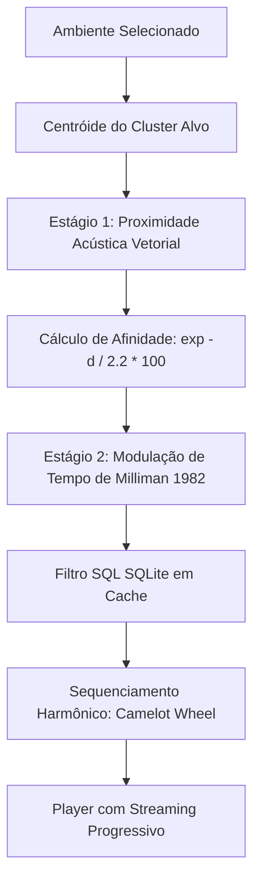
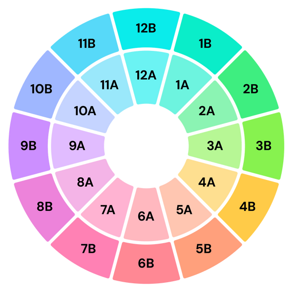
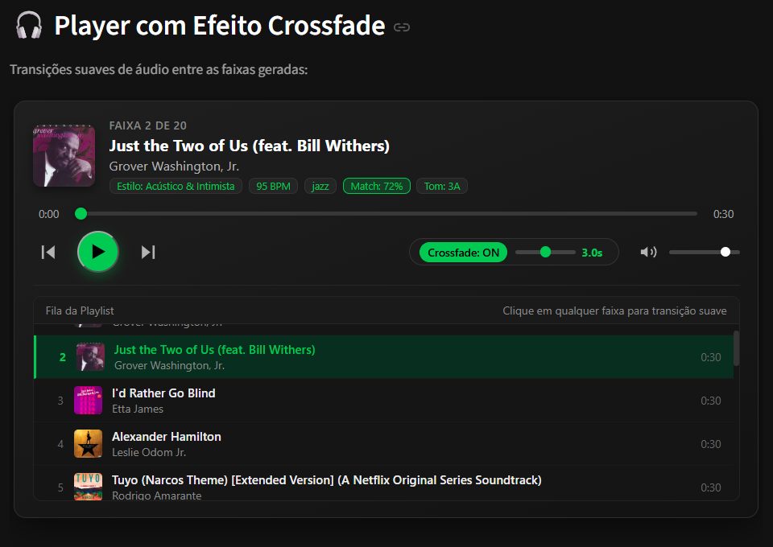

# Aplicação Retail Sound

A aplicação **Retail Sound** ([`apps/consulta_sql_dataset_streamlit.py`](../../apps/consulta_sql_dataset_streamlit.py)) é uma plataforma interativa de inteligência em curadoria sonora comercial desenvolvida com **Streamlit**, **SQLite** e o ecossistema Python.

Ela traduz os achados dos modelos estatísticos em uma ferramenta operacional prática para lojistas, gerentes de marca e curadores musicais.

---

## 1. Como a Aplicação Funciona

Diferente de geradores de playlists tradicionais que se apoiam em gêneros genéricos, o Retail Sound opera através de um **motor de recomendação em dois estágios** (baseado na metodologia desenvolvida no [`notebooks/sonora.ipynb`](../../notebooks/sonora.ipynb)), associado a **regras de comportamento de consumo** e **sequenciamento harmônico**.



### A. Estágio 1 — Mapeamento de Ambiente e Afinidade Acústica
Cada ambiente comercial selecionado (Supermercado, Café, Academia, Livraria, Restaurante, Moda) possui um perfil acústico de referência ancorado nos centróides dos clusters:

$$\text{Acoustic Match} = \exp\left(-\frac{d_t}{2{,}2}\right) \times 100$$

Onde $d_t$ representa a distância euclidiana normalizada entre a assinatura da música e o centróide ideal do ambiente. O índice varia de **0% a 100%**, priorizando faixas que compõem perfeitamente a atmosfera desejada.

### B. Estágio 2 — Modulação Comportamental de Andamento (Regra de Milliman)
Com base no estudo seminal de **Ronald E. Milliman (1982)** sobre o impacto da música de fundo no comportamento de compradores:
- **Ritmo Lento (Slow Tempo — até 108 BPM)**: Reduz a velocidade de deslocamento dos clientes nos corredores, ampliando o tempo de permanência (*dwell time*) e resultando em um aumento comprovado no volume de vendas e no ticket médio. Indicado para supermercados, cafeterias, livrarias e lojas de varejo refinadas.
- **Ritmo Acelerado (Fast Tempo — acima de 115 BPM)**: Acelera o fluxo e a rotação de clientes (essencial para restaurantes de alta rotatividade nos horários de pico) ou fornece cadência fisiológica de incentivo em academias e centros esportivos.

### C. Sequenciamento Harmônico (Camelot Wheel)

{ width="300" align="center"}

Para evitar quebras abruptas de tonalidade entre faixas sucessivas, o algoritmo ordena a fila de reprodução através da **Roda de Camelot** (afinidade de armadura e modo musical), garantindo transições harmônicas naturais como as realizadas por DJs profissionais.

---

## 2. Player de Áudio com Streaming Progressivo

Para oferecer uma experiência de audição fluida e sem esperas, a aplicação implementa um sistema de download assíncrono com sincronização de fila em tempo real:

1. **Início Imediato na 1ª Faixa**: A interface não precisa aguardar o download de todas as prévias. Assim que a primeira música é obtida via Deezer/iTunes API, o player de áudio é renderizado na tela e inicia a reprodução.
2. **Download em Segundo Plano**: Uma barra de progresso dedicada exibe a faixa que está sendo baixada no momento e o contador de faixas restantes na fila.
3. **Sincronização sem Interrupção (Web Messaging)**: As novas faixas baixadas são transmitidas para o iframe do player através de canais `BroadcastChannel` e `window.postMessage`. A lista de reprodução interna é atualizada dinamicamente **sem reiniciar a música em execução** e sem perda de estado.
4. **Equal-Power Crossfading**: Transição suave entre o final de uma faixa e o início da próxima utilizando curvas senoidais com compensação de ganho acústico via Web Audio API.

---

## 3. Capturas de Tela da Aplicação

*(Clique em qualquer imagem para ampliar em tela cheia com zoom interativo)*

### A. Painel Principal de Curadoria Sonora
A interface centralizada do **Retail Sound** permite ao curador ou lojista selecionar o ambiente desejado (ex.: **Academia**), carregando instantaneamente as atmosferas recomendadas (*Social & Ensolarado* e *Intenso & Dinâmico*), a modulação rítmica de Milliman (1982) e as tabelas com as descrições dos estilos musicais:


### B. Reprodutor de Áudio com Equal-Power Crossfade
O reprodutor integrado busca as prévias de 30 segundos via API externa e executa transições contínuas sem cortes bruscos. No exemplo abaixo, a música *Just the Two of Us* é executada com tags contextuais em tempo real (`Match: 72%`, `Tom: 3A`, `95 BPM`, `Estilo: Acústico & Intimista`), botão de alternância de crossfade e fila dinâmica de reprodução:



---

## 4. Como Executar a Aplicação

### Pré-requisitos
- **Python 3.10 ou superior** instalado no sistema.
- Terminal com acesso à internet (para download inicial de dependências e amostras de áudio).

---

### Passo a Passo de Execução

#### 1. Clonar ou Acessar o Repositório
Abra o terminal na pasta raiz do projeto:
```bash
cd /caminho/para/r.ia-spotify_nano_challenge
```

#### 2. Configurar o Ambiente Virtual

No **Linux** ou **macOS**:
```bash
# Cria o ambiente virtual
python3 -m venv .venv

# Ativa o ambiente
source .venv/bin/activate
```

No **Windows** (PowerShell):
```powershell
# Cria o ambiente virtual
python -m venv .venv

# Ativa o ambiente
.venv\Scripts\Activate.ps1
```

#### 3. Instalar as Dependências
Com o ambiente ativado, instale os pacotes listados no `requirements.txt`:
```bash
pip install -r requirements.txt
```

#### 4. Iniciar o Servidor Streamlit
Execute o comando:
```bash
streamlit run apps/consulta_sql_dataset_streamlit.py
```

A aplicação será iniciada e abrirá automaticamente no navegador em `http://localhost:8501`.

---

## 5. Uso da Interface

1. **Escolha do Ponto Comercial**: Selecione o ambiente comercial que deseja sonorizar (ex.: *Restaurante*, *Loja de alto padrão*, *Academia*, *Mercado*).
2. **Atmosferas e Estilos Sonoros**: Selecione os perfis sonoros sugeridos para compor a atmosfera desejada.
3. **Ajustes Finos e Filtros (Opcional)**: No sanfonado de parâmetros, ajuste as 4 dimensões de áudio, faixa de popularidade, gêneros e filtro de conteúdo explícito.
4. **Geração e Audição**: Escolha o tamanho da playlist (5 a 50 faixas) e clique em **Gerar Playlist**. O player inteligente iniciará automaticamente na primeira faixa disponível com efeito de crossfade.
5. **Exportação**: Baixe a lista gerada em formato CSV ou os previews em arquivo ZIP, ou realize consultas SQL customizadas diretamente sobre o banco SQLite integrado.

