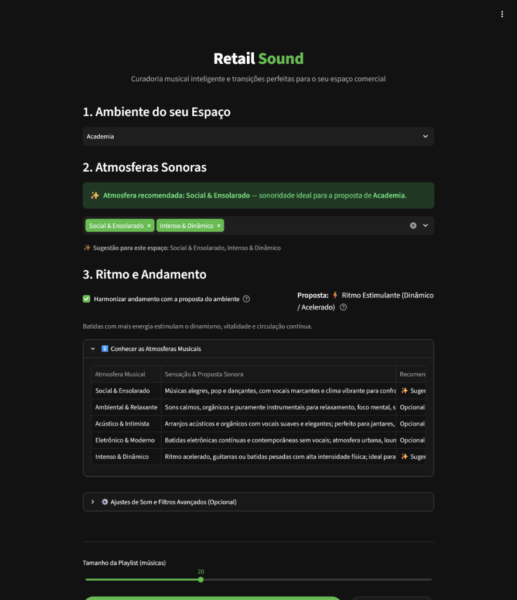

# Apresentação Final — Retail Sound

> **"Sua loja no ritmo do seu público: Sistema inteligente de recomendação e avaliação de playlists para ambientes comerciais."**

Esta seção reúne os materiais da apresentação executiva e técnica do projeto **Retail Sound**, desenvolvido pelo **Time 6** para o *Nano Challenge* da Residência em Inteligência Artificial promovida pelo **Instituto ELDORADO**, em parceria com a **Universidade de Brasília (UnB)** e o **Laboratório de Tecnologias Livres (Lab Livre)**.

---

## 1. Visualização e Download do PDF

O documento oficial de apresentação (12 slides com design de alta fidelidade) pode ser baixado ou visualizado interativamente abaixo:

  <a href="./assets/apresentacao_final_retail_sound.pdf" class="md-button md-button--primary" download>
    📥 Baixar Apresentação em PDF (7,2 MB)
  </a>
  <a href="./assets/apresentacao_final_retail_sound.pdf" class="md-button" target="_blank" rel="noopener">
    🔗 Abrir em Nova Aba
  </a>

  <iframe src="./assets/apresentacao_final_retail_sound.pdf" width="100%" height="600px" style="border: none; display: block;">
    

      Seu navegador não suporta visualização direta de PDFs incorporados. 
      <a href="./assets/apresentacao_final_retail_sound.pdf" style="color: #1db954;">Clique aqui para baixar e visualizar a apresentação</a>.
    

  </iframe>

---

## 2. Capturas de Tela da Aplicação em Operação

*(Clique em qualquer imagem para abrir em tela cheia com zoom interativo)*

### A. Painel de Curadoria Sonora e Seleção de Ambientes
A interface principal do **Retail Sound** permite ao curador ou gerente comercial configurar com precisão a atmosfera acústica do espaço. No exemplo abaixo, o ambiente **Academia** é selecionado, carregando instantaneamente os estilos recomendados (*Social & Ensolarado* e *Intenso & Dinâmico*), a modulação de andamento acelerado baseada na regra de Milliman (1982) e os parâmetros sonoros:

### B. Player de Áudio com Equal-Power Crossfade e Fila em Tempo Real
O reprodutor integrado busca amostras de alta fidelidade via API externa e executa transições contínuas sem cortes bruscos. A imagem abaixo destaca a reprodução de *Just the Two of Us*, com exibição de tags contextuais em tempo real (`Estilo: Acústico & Intimista`, `95 BPM`, `Match: 72%`, `Tom: 3A` na Roda de Camelot), controle de crossfade configurável e fila de reprodução sequencial:

---

## 3. Síntese dos Slides da Apresentação

Para consulta rápida, apresentamos a seguir o roteiro argumentativo e estratégico contido nos 12 slides da apresentação executiva:

### Slide 01 — Capa do Projeto
- **Título**: Retail Sound — Sua loja no ritmo do seu público.
- **Proposta de Valor**: Sistema inteligente de recomendação e avaliação de playlists para ambientes comerciais.
- **Tríade Estratégica**: *Música + Dados + Experiência de Compra*.

### Slide 02 — O Ponto de Partida
- **Cenário Diário**: Todos os dias, alguém escolhe o som ambiente da loja. Quase sempre a decisão é tomada por gosto estritamente pessoal, sem levar em consideração o perfil do consumidor, o horário do dia ou o objetivo de conversão do estabelecimento.
- **A Pergunta que Iniciou o Projeto**:
  > *"E se a música pudesse ser escolhida com base em dados — e depois avaliada pelos resultados reais da loja?"*

### Slide 03 — Diagnóstico de Mercado
- **Cenário Atual**: A música está presente na imensa maioria dos pontos físicos, mas ainda é tratada de forma empírica (escolha aleatória de playlists comerciais, pouca adaptação ao contexto e zero correlação com métricas de negócio).
- **Oportunidade**: Transformar a trilha sonora em uma **hipótese mensurável** sobre experiência, tempo de permanência (*dwell time*) e comportamento de compra.

### Slide 04 — Como Funciona em uma Frase
O Retail Sound opera sob um ciclo virtuoso contínuo:
1. **Recomenda**: Seleciona músicas por ritmo (BPM), energia, valência emocional, volume, gênero e popularidade calibrada.
2. **Acompanha**: Registra a playlist executada, horários, fluxo de visitantes, volume de vendas, faturamento e permanência.
3. **Aperfeiçoa**: Cruza os resultados de negócio e retroalimenta as próximas recomendações do estabelecimento.

### Slide 05 — Fluxo Funcional em Três Etapas
1. **Etapa 01 — Entender a Loja**: Mapeamento do segmento comercial, perfil demográfico do público, faixa horária e objetivo primário do espaço.
2. **Etapa 02 — Calcular Adequação**: Algoritmo de similaridade acústica vetorial com os centróides ideais do ambiente, balanceado com popularidade e modulação de andamento.
3. **Etapa 03 — Medir o Desempenho**: Acompanhamento de taxa de conversão, ticket médio, receita por visitante e tempo de permanência.

### Slide 06 — O Motor por Trás da Recomendação
- **Entradas Musicais**: Tempo (BPM), Energia, Valência, Acústica, Gênero, Conteúdo Explícito e Popularidade.
- **Adequação por Perfis Acústicos (K-Means com $K=5$)**:
  - *Social & Ensolarado*: Alta energia, alta valência, pop e dançante.
  - *Ambiente & Relaxante*: Baixa energia, puramente instrumental e orgânico.
  - *Acústico & Intimista*: Sonoridade acolhedora, voz e violão, elegância.
  - *Eletrônico & Moderno*: Batidas sintéticas contemporâneas sem vocais.
  - *Intenso & Dinâmico*: Ritmo enérgico, guitarras e batidas vigorosas.

### Slide 07 — Prova de Conceito Concluída
- **79 mil registros musicais analisados** e higienizados a partir do catálogo bruto de 114k faixas do Spotify.
- **8 contextos comerciais modelados**: Restaurante, Loja de Alto Padrão, Fast Fashion, Ambiente Relaxante, Academia, Loja de Roupas, Shopping e Supermercado.
- **Playlists dinâmicas de 5 a 50 faixas** geradas sob demanda com controle de dispersão de artistas e filtros de conteúdo explícito.

### Slide 08 — Personalização por Ambiente
Cada tipologia de espaço físico recebe uma lógica musical customizada:
- **Alto Padrão**: Ritmo mais lento, volume moderado e maior predominância acústica.
- **Fast Fashion**: Energia e dançabilidade elevadas para estimular dinamismo.
- **Supermercado**: Ritmo moderado e ambiente acolhedor para ampliar a permanência.
- **Café Casual**: Energia moderada-baixa com calor e textura acústica.
- **Ambiente Noturno**: Alta energia, valência estimulante e dançabilidade máxima.
- **Loja Infantil**: Humor positivo, sonoridade solar e filtro estrito anti-conteúdo explícito.

### Slide 09 — Separação entre Recomendação e Comprovação
- **O que está implementado (Recomendador Funcional)**:
  - Índice de adequação musical vetorial exponencial.
  - Ranking de faixas ajustado por contexto comercial.
  - Filtros granulares de gênero, estilo e conteúdo explícito.
  - Garantia de diversidade de artistas e transição harmônica pela Roda de Camelot.
- **O que será validado em campo (Testes em Loja Física)**:
  - Variação percentual na taxa de conversão.
  - Impacto no ticket médio por cliente.
  - Receita média gerada por visitante.
  - Tempo médio de permanência (*dwell time*).

### Slide 10 — Metodologia de Validação Científica (Testes A/B)
A validação de negócio ocorre por meio de experimentação controlada no próprio ponto de venda:
- **Playlist A**: Trilha tradicional aplicada em dias e horários controlados.
- **Playlist B**: Trilha gerada pelo Retail Sound aplicada em períodos de tráfego comparável.
- **Variáveis de Controle**: Clima, promoções e sazonalidade mantidos idênticos para isolar a influência da música.
- **Meta do Experimento**: Comprovar associações estatisticamente confiáveis, sem promessas automáticas ou infundadas de venda.

### Slide 11 — Próximos Passos (Do Protótipo ao Produto)
1. **Agora**: Refinar a base de dados com preservação de precisão decimal contínua e calibração fina dos pesos de ranking.
2. **Piloto**: Realizar testes piloto em ambiente comercial parceiro, coletando métricas de vendas e permanência.
3. **Evolução**: Desenvolver sistema adaptativo que aprende continuamente com as vendas reais da loja e auto-ajusta as recomendações por hora do dia.

### Slide 12 — Conclusão
> **"A música deixa de ser apenas som de fundo. Ela se torna uma decisão que pode ser recomendada, testada e aperfeiçoada."**

---

## 4. Créditos da Equipe (Time 6)

| Integrante | Contribuição Principal |
| :--- | :--- |
| **Gabriel Maciel Araújo** | Arquitetura de Software, Modelagem e Interface Streamlit |
| **Matheus Henrique Picone Rosa** | Análise Estatística, Modelos Analíticos e Curadoria |
| **João Vítor Carvalho Barbosa** | Engenharia de Dados, ETL e Pipeline de Higienização |
| **Mahiaara Amanda Pereira Barros** | Pesquisa Comportamental e Parâmetros Acústicos |
| **Keila Alves Ferreira** | Modelagem de Negócio, Validação e Documentação |

